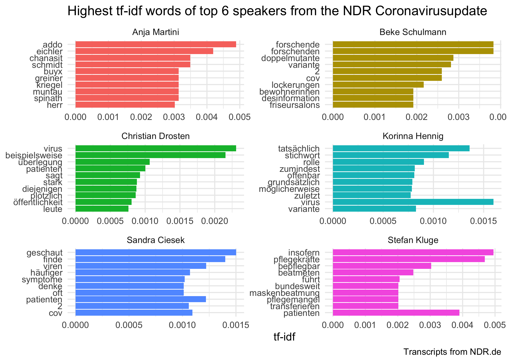

<!-- README.md is generated from README.Rmd. Please edit that file -->

# coronavirusupdate

<!-- badges: start -->

<!-- badges: end -->

When the [NDR
Coronavirus-Update](https://www.ndr.de/nachrichten/info/podcast4684.html)
announced that they would make transcripts of all episodes publicly
available I firstly tried to scrape the PDF files, which [kind of
worked](https://quickcoffee.netlify.app/post/topic-modelling-on-one-of-germany-s-most-popular-corona-podcast/)
but was not very reliable. So I went back and now used the transcripts
directly from the [podcast’s
homepage](https://www.ndr.de/nachrichten/info/Coronavirus-Update-Die-Podcast-Folgen-als-Skript,podcastcoronavirus102.html).  
Consequently I decided to create a R package to make it easy for anyone
to scrape and access the data.  
In this repo every Wednesday a GitHub action is triggered to get the
newest transcripts from NDR.de (as long as the website doesn’t
change).  
For all non-R users you can also find the data as parquet file in
`data/coronavirusupdate_transcripts.parquet`.

## Installation

You can install this package from [GitHub](https://github.com/) with:

``` r
# install.packages("devtools")
devtools::install_github("quickcoffee/coronavirusupdate")
```

## Example

This is a basic example how to load the transcript data:

``` r
library(coronavirusupdate)
## load data
data("coronavirusupdate_transcripts")
```

This will load a tidy dataframe called `coronavirus_update` with one row
per paragraph. Currently this includes 86 episodes with the following
structure:

``` r
library(dplyr)
glimpse(coronavirusupdate_transcripts)
#> Rows: 6,465
#> Columns: 8
#> $ title            <chr> "Das Beispiel Indien", "Das Beispiel Indien", "Das Be…
#> $ link             <chr> "https://www.ndr.de/nachrichten/info/86-Coronavirus-U…
#> $ episode_no       <int> 86, 86, 86, 86, 86, 86, 86, 86, 86, 86, 86, 86, 86, 8…
#> $ speaker          <chr> "Korinna Hennig", "Korinna Hennig", "Korinna Hennig",…
#> $ text             <chr> "Wir müssen über Indien sprechen, die Gründe für dies…
#> $ paragraph_no     <int> 1, 2, 3, 4, 5, 6, 7, 8, 9, 10, 11, 12, 13, 14, 15, 16…
#> $ last_change      <dttm> 2021-04-28 16:24:00, 2021-04-28 16:24:00, 2021-04-28…
#> $ duration_episode <chr> NA, NA, NA, NA, NA, NA, NA, NA, NA, NA, NA, NA, NA, N…
```

With this dataset one could for example inspect the share per speaker
and episode:

``` r
library(ggplot2)

coronavirusupdate_transcripts %>%
  mutate(paragraph_length = nchar(text)) %>% 
  group_by(episode_no, speaker) %>% 
  summarise(speaker_length = sum(paragraph_length)) %>% 
  group_by(episode_no) %>% 
  mutate(speaker_share = speaker_length/sum(speaker_length)) %>% 
  ggplot(aes(x=episode_no, y=speaker_share, fill = speaker))+
  geom_bar(position="stack", stat="identity")+
  theme_minimal()+
  theme(legend.position="bottom")+
  labs(title = "Share of speaker per episode",
       y = "Share",
       x = "Episode No",
       fill = element_blank())
```


Or one can create a tf-idf analysis to find out which words are “unique”
to each speaker:

``` r
library(tidytext) #for text processing and analysis
library(ggplot2) # for plotting

# create tibble with stopwords from stopwords package and some very frequent words in the corpus
stop_words_de <- tibble(word = c(stopwords::stopwords("de"),
                                 "dass",
                                 "schon",
                                 "mal",
                                 "ja",
                                 "ganz",
                                 "gibt",
                                 "sagen"))

# get top 6 speaker by paragraph count
top_speaker <- coronavirusupdate_transcripts %>% 
  count(speaker, sort = TRUE) %>% 
  head(6) %>% 
  pull(speaker)

tidy_corona <- coronavirusupdate_transcripts %>%
  filter(speaker %in% top_speaker) %>%
  select(episode_no, speaker, text) %>%
  unnest_tokens(word, text) %>% 
  anti_join(stop_words_de)

#get tf-idf per speaker
tidy_corona_tf_idf <- tidy_corona %>%
  count(speaker, word) %>% 
  ungroup() %>% 
  bind_tf_idf(word, speaker, n)


tidy_corona_tf_idf %>% 
  group_by(speaker) %>% 
  slice_max(tf_idf, n = 10, with_ties = FALSE) %>% 
  mutate(word = factor(word, levels = rev(unique(word)))) %>%
  ggplot(aes(tf_idf, word, fill = speaker)) +
  geom_col(show.legend = FALSE) +
  facet_wrap(~speaker, ncol = 2, scales = "free") +
  labs(title = "Highest tf-idf words of top 6 speakers from the NDR Coronavirusupdate",
       caption = "Transcripts from NDR.de",
       x = "tf-idf", y = NULL)+
  theme_minimal()
```


